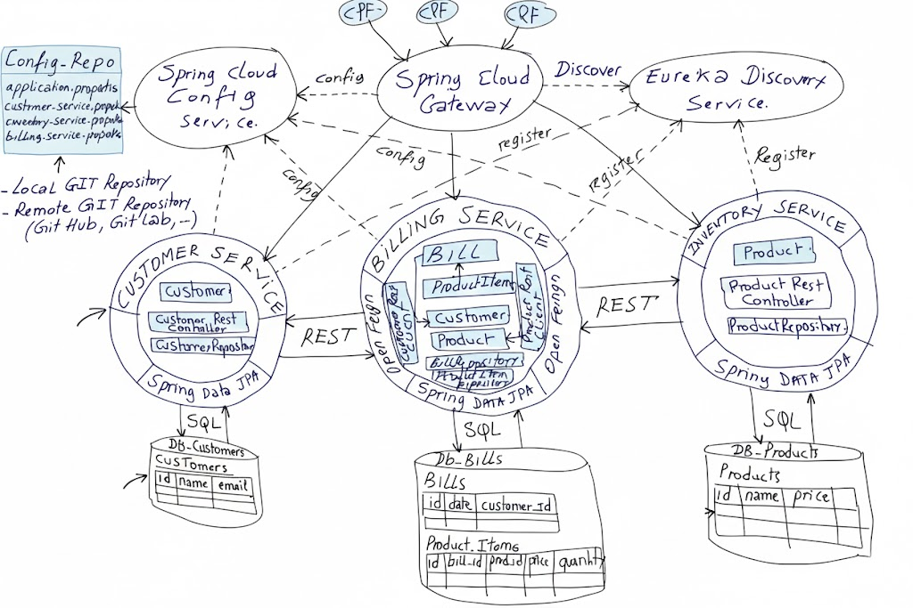
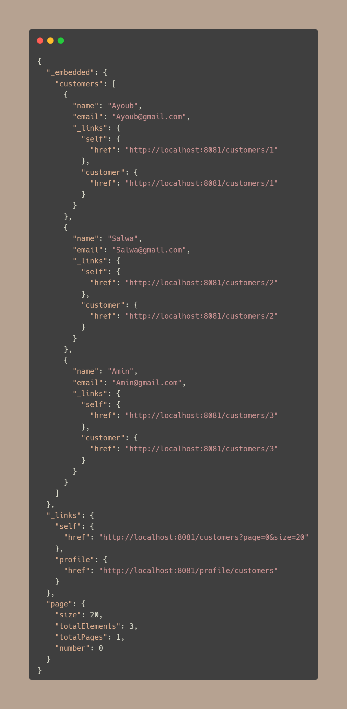
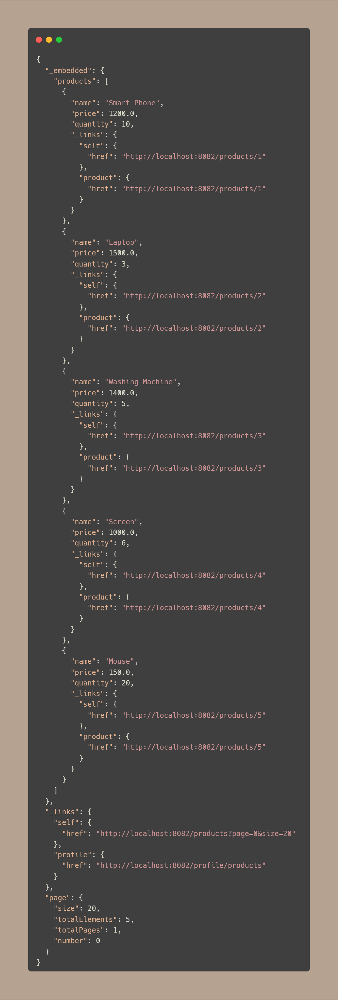
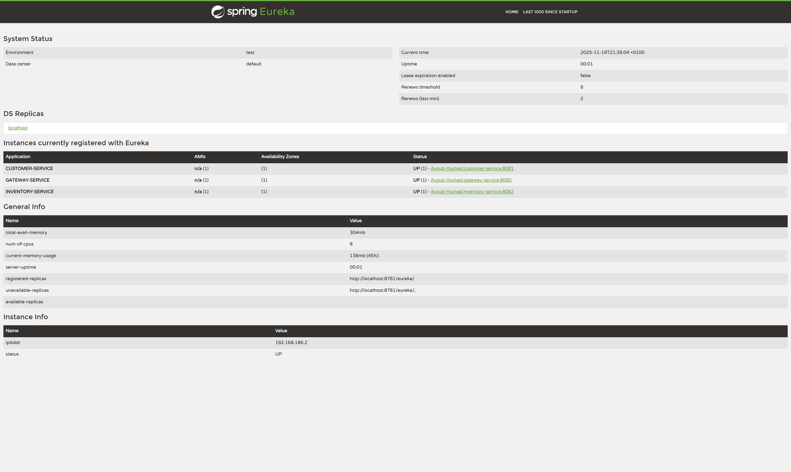
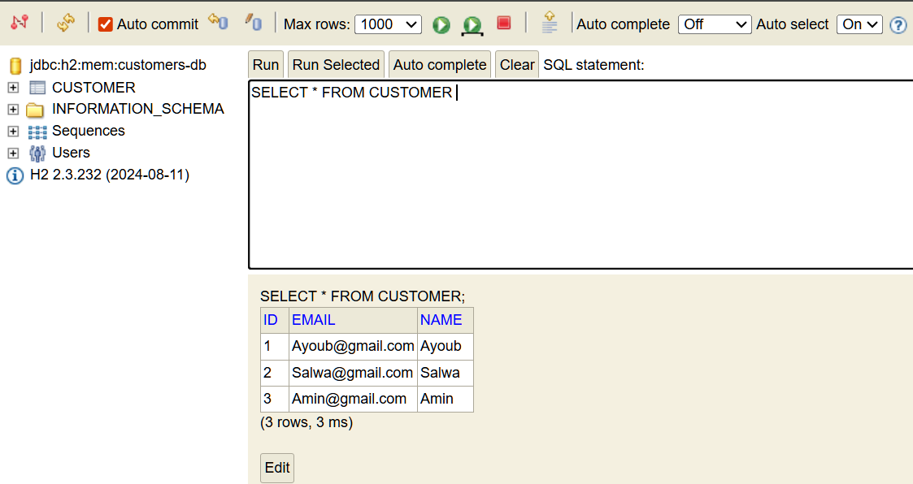
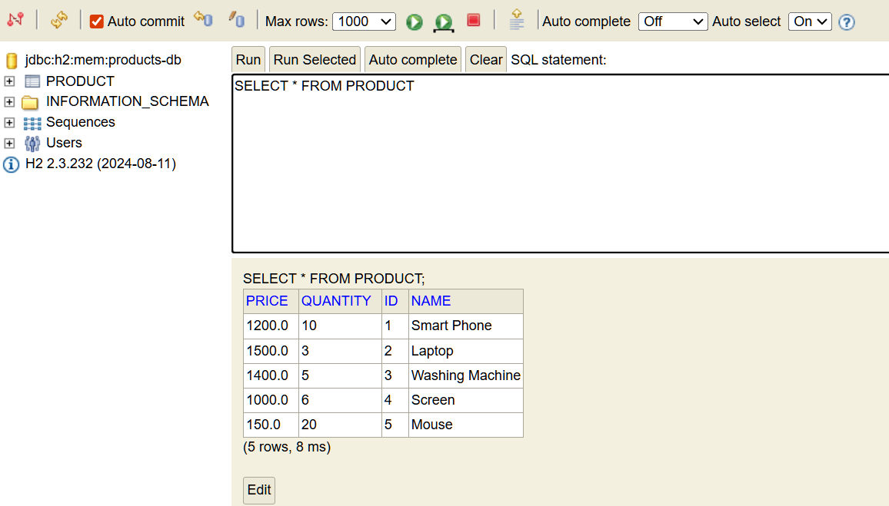
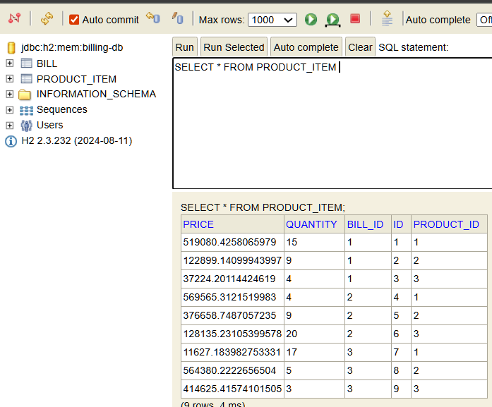
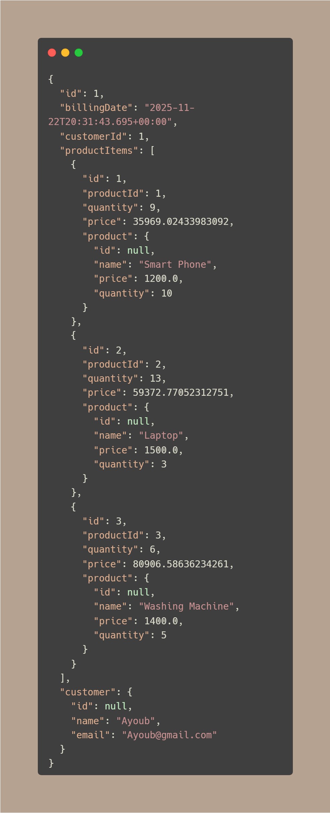

# Microservices Architecture Project

A complete Spring Boot microservices architecture demonstrating service discovery, API gateway, inter-service communication, and resilience patterns.

## 📋 Table of Contents

- [Architecture Overview](#architecture-overview)
- [Services](#services)
- [Technologies Used](#technologies-used)
- [Prerequisites](#prerequisites)
- [Getting Started](#getting-started)
- [API Endpoints](#api-endpoints)
- [Service Communication](#service-communication)
- [Testing the Application](#testing-the-application)
- [Architecture Patterns](#architecture-patterns)

## 🏗️ Architecture Overview

This project implements a microservices architecture with the following components:



## 🔧 Services

### 1. Discovery Service (Eureka Server)
**Port:** 8761

Service registry that enables service discovery for all microservices.

**Key Features:**
- Netflix Eureka Server
- Central service registry
- Health monitoring of registered services

**Configuration:**
- Standalone mode (does not register with itself)
- Dashboard available at `http://localhost:8761`

---

### 2. Gateway Service
**Port:** 8080

API Gateway providing a single entry point for all microservices.

**Key Features:**
- Spring Cloud Gateway (Reactive)
- Dynamic routing using service discovery
- Load balancing

**Routing Strategy:**
- Uses `DiscoveryClientRouteDefinitionLocator` for automatic routing
- Routes requests based on service names from Eureka

**Access Pattern:**
```
http://localhost:8080/{service-name}/{endpoint}
```

---

### 3. Customer Service
**Port:** 8081  
**Database:** H2 (in-memory) - `customers-db`

Manages customer information.

**Entity:**
```java
Customer {
    Long id
    String name
    String email
}
```

**Pre-loaded Data:**
- Ayoub (Ayoub@gmail.com)
- Salwa (Salwa@gmail.com)
- Amin (Amin@gmail.com)

**Endpoints:**
- `GET /customers` - List all customers
- `GET /customers/{id}` - Get customer by ID
- Spring Data REST endpoints available



---

### 4. Inventory Service
**Port:** 8082  
**Database:** H2 (in-memory) - `products-db`


Manages product inventory.

**Entity:**
```java
Product {
    Long id
    String name
    double price
    int quantity
}
```

**Pre-loaded Data:**
- Smart Phone ($1200, Qty: 10)
- Laptop ($1500, Qty: 3)
- Washing Machine ($1400, Qty: 5)
- Screen ($1000, Qty: 6)
- Mouse ($150, Qty: 20)

**Endpoints:**
- `GET /products` - List all products
- `GET /products/{id}` - Get product by ID
- Spring Data REST endpoints available



---

### 5. Billing Service
**Port:** 8083  
**Database:** H2 (in-memory) - `billing-db`

Manages billing operations and aggregates data from Customer and Inventory services.


**Entities:**
```java
Bill {
    Long id
    Date billingDate
    long customerId
    List<ProductItem> productItems
    Customer customer (transient)
}

ProductItem {
    Long id
    long productId
    int quantity
    double price
    Bill bill
    Product product (transient)
}
```

**Key Features:**
- Feign clients for inter-service communication
- Circuit breaker pattern with Resilience4j
- Aggregates customer and product information

**Endpoints:**
- `GET /API/bills/{id}` - Get bill with complete customer and product details

**Data Initialization:**
- Creates bills for 3 customers
- Each bill contains random product items

---

## 💻 Technologies Used

### Core Framework
- **Spring Boot:** 3.5.7
- **Spring Cloud:** 2025.0.0
- **Java:** 21

### Spring Cloud Components
- **Eureka Server/Client:** Service discovery
- **Spring Cloud Gateway:** API Gateway (WebFlux)
- **OpenFeign:** Declarative REST client
- **Resilience4j:** Circuit breaker implementation

### Data & Persistence
- **Spring Data JPA:** Data access layer
- **Spring Data REST:** RESTful repositories
- **H2 Database:** In-memory database

### Development Tools
- **Lombok:** Reduce boilerplate code
- **Spring Boot Actuator:** Monitoring and management
- **Maven:** Build tool

---

## 📋 Prerequisites

- **JDK 21** or higher
- **Maven 3.6+**
- **IDE** (IntelliJ IDEA, Eclipse, or VS Code)

---

## 🚀 Getting Started

### 1. Clone the Repository
```bash
git clone <repository-url>
cd microservices_architecture
```

### 2. Start Services in Order

#### Step 1: Start Discovery Service
```bash
cd discovery-service
mvn spring-boot:run
```
Wait until Eureka dashboard is available at `http://localhost:8761`

#### Step 2: Start Customer Service
```bash
cd customer-service
mvn spring-boot:run
```

#### Step 3: Start Inventory Service
```bash
cd inventory-service
mvn spring-boot:run
```

#### Step 4: Start Billing Service
```bash
cd billing-service
mvn spring-boot:run
```

#### Step 5: Start Gateway Service
```bash
cd gateway-service
mvn spring-boot:run
```

### 3. Verify Services
Visit Eureka Dashboard: `http://localhost:8761`

You should see all services registered:
- CUSTOMER-SERVICE
- INVENTORY-SERVICE
- BILLING-SERVICE
- GATEWAY-SERVICE



---

## 🔌 API Endpoints

### Through Gateway (Port 8080)

#### Customer Service
```bash
# Get all customers
curl http://localhost:8080/customer-service/customers

# Get specific customer
curl http://localhost:8080/customer-service/customers/1
```

#### Inventory Service
```bash
# Get all products
curl http://localhost:8080/inventory-service/products

# Get specific product
curl http://localhost:8080/inventory-service/products/1
```

#### Billing Service
```bash
# Get bill with full details
curl http://localhost:8080/billing-service/API/bills/1
```

### Direct Access (Without Gateway)

#### Customer Service (Port 8081)
```bash
curl http://localhost:8081/customers
curl http://localhost:8081/customers/1
```

#### Inventory Service (Port 8082)
```bash
curl http://localhost:8082/products
curl http://localhost:8082/products/1
```

#### Billing Service (Port 8083)
```bash
curl http://localhost:8083/API/bills/1
```

### H2 Database Consoles

- **Customer DB:** `http://localhost:8081/h2-console`
    - JDBC URL: `jdbc:h2:mem:customers-db`
    - 

- **Inventory DB:** `http://localhost:8082/h2-console`
    - JDBC URL: `jdbc:h2:mem:products-db`
    - 

- **Billing DB:** `http://localhost:8083/h2-console`
    - JDBC URL: `jdbc:h2:mem:billing-db`
    - 
    - 

**Credentials:** username: `sa`, password: (empty)

---

## 🔄 Service Communication

### Feign Clients in Billing Service

The Billing Service communicates with other services using OpenFeign:

#### Customer Service Client
```java
@FeignClient(name = "customer-service")
public interface CustomerServiceRestClient {
    @GetMapping(path = "/customers/{id}")
    @CircuitBreaker(name = "customerService", fallbackMethod = "findCustomerByIdFallback")
    Customer findCustomerById(@PathVariable Long id);
}
```

#### Inventory Service Client
```java
@FeignClient(name = "inventory-service")
public interface InventoryServiceRestClient {
    @GetMapping(path = "/products/{id}")
    @CircuitBreaker(name = "inventoryService", fallbackMethod = "findProductByIdFallback")
    Product findProductById(@PathVariable Long id);
}
```

### Circuit Breaker Pattern

When a service is unavailable, the circuit breaker provides fallback responses:
- **Customer Service Down:** Returns customer with id, name="unknown", email="unknown"
- **Inventory Service Down:** Returns product with id, name="unknown", price=0, quantity=0

---

## 🧪 Testing the Application

### Test Complete Bill Retrieval

```bash
curl http://localhost:8080/billing-service/API/bills/1 | json_pp
```

**Expected Response:**



### Test Circuit Breaker

1. **Stop Customer Service**
```bash
# Stop customer-service
```

2. **Call Billing API**
```bash
curl http://localhost:8080/billing-service/API/bills/1
```

You should see fallback data for the customer.

---

## 🏛️ Architecture Patterns

### 1. Service Discovery Pattern
- **Implementation:** Netflix Eureka
- **Benefits:** Dynamic service location, automatic scaling support

### 2. API Gateway Pattern
- **Implementation:** Spring Cloud Gateway
- **Benefits:** Single entry point, routing, load balancing

### 3. Circuit Breaker Pattern
- **Implementation:** Resilience4j
- **Benefits:** Fault tolerance, graceful degradation

### 4. Database Per Service
- **Implementation:** Separate H2 databases
- **Benefits:** Service independence, loose coupling

### 5. RESTful Communication
- **Implementation:** Spring Data REST + OpenFeign
- **Benefits:** Standard HTTP/REST, easy integration

---

## 📁 Project Structure

```
microservices_architecture/
├── discovery-service/          # Eureka Server
├── gateway-service/            # API Gateway
├── customer-service/           # Customer management
├── inventory-service/          # Product inventory
├── billing-service/            # Billing & aggregation
└── pom.xml                     # Parent POM (if applicable)
```

---

## 🔧 Configuration Summary

| Service | Port | Database | Purpose |
|---------|------|----------|---------|
| Discovery | 8761 | - | Service Registry |
| Gateway | 8080 | - | API Gateway |
| Customer | 8081 | customers-db | Customer Management |
| Inventory | 8082 | products-db | Product Management |
| Billing | 8083 | billing-db | Billing & Aggregation |

---

## 🎯 Learning Objectives

This project demonstrates:

✅ Microservices architecture design  
✅ Service discovery with Eureka  
✅ API Gateway pattern  
✅ Inter-service communication with Feign  
✅ Resilience patterns (Circuit Breaker)  
✅ Spring Cloud ecosystem  
✅ RESTful API design  
✅ Database per service pattern

---

## 🐛 Troubleshooting

### Services Not Registering with Eureka
- Ensure Discovery Service is running first
- Check `spring.cloud.discovery.enabled=true` in configuration
- Wait 30-60 seconds for registration to complete

### Port Already in Use
```bash
# Find process using port
lsof -i :8080
# Kill process
kill -9 <PID>
```

### H2 Console Not Accessible
- Verify `spring.h2.console.enabled=true`
- Check correct port number
- Use correct JDBC URL

---

## 📝 License

This project is created for educational purposes as a learning exercise in microservices architecture.

---

## 👨‍💻 Author

**Youhad**  
Learning microservices architecture with Spring Cloud

---

## 🤝 Contributing

This is a learning project. Feel free to fork and experiment!

---

**Happy Learning! 🚀**