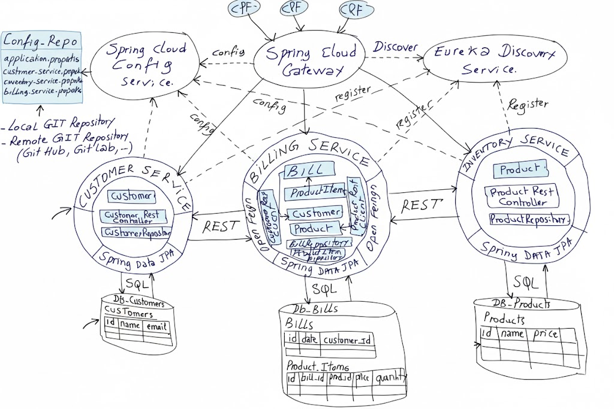
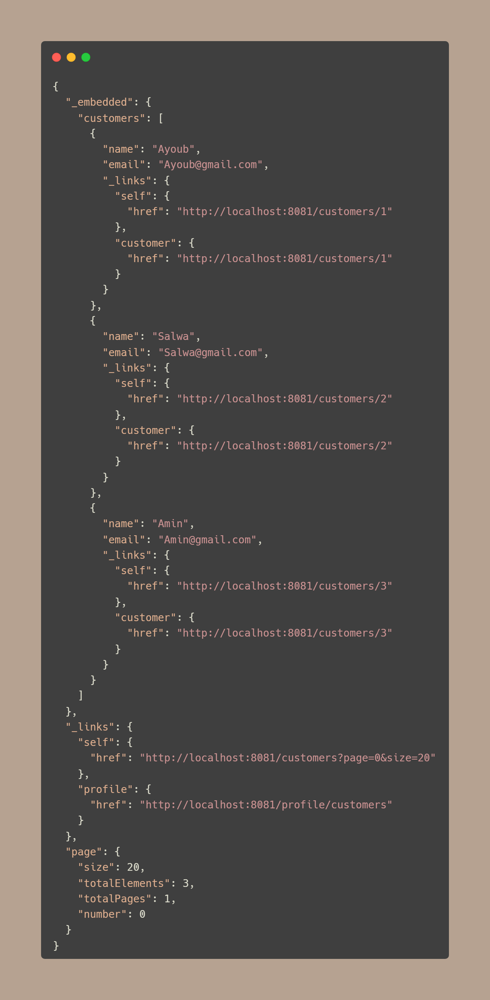
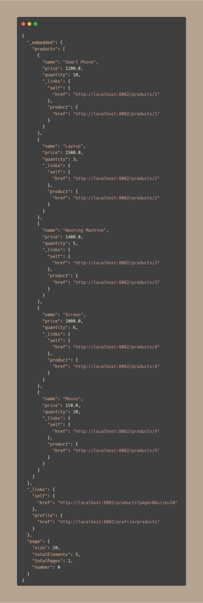
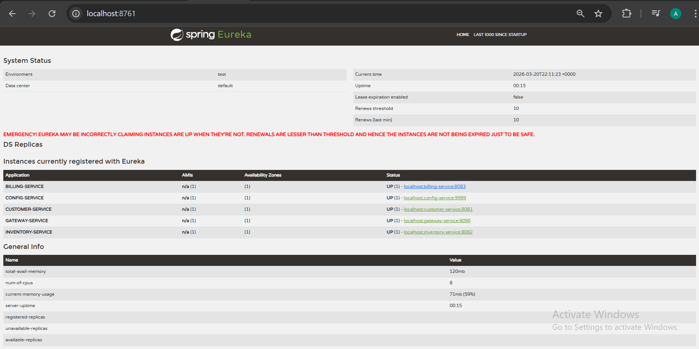
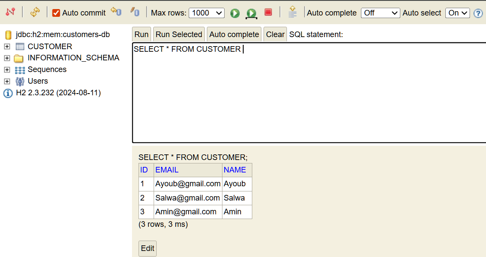
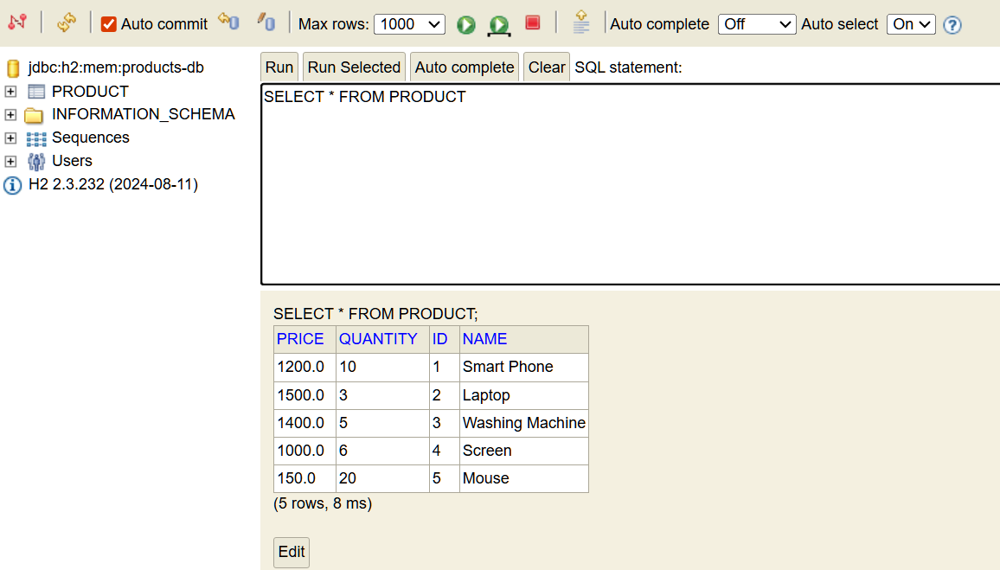
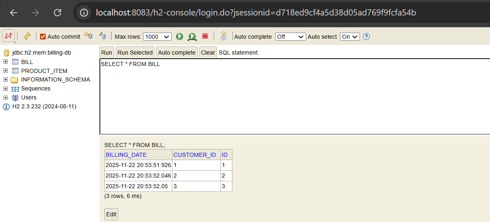
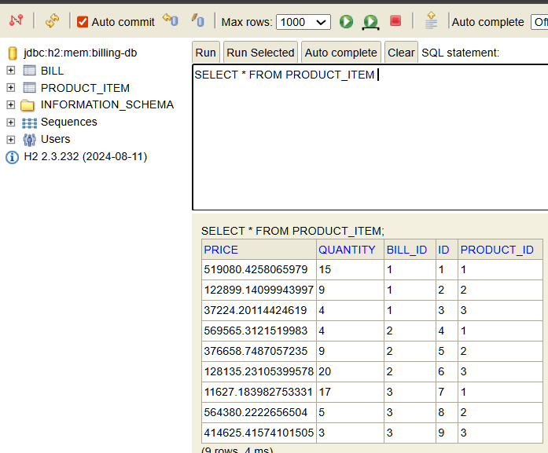
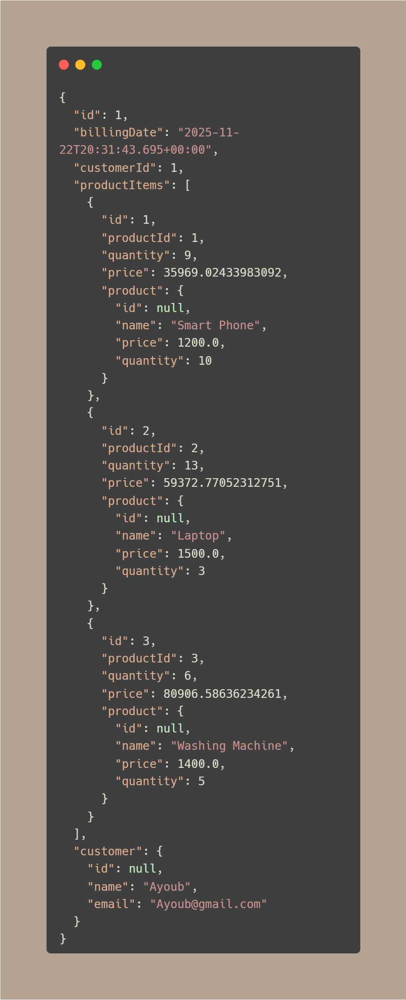

# Microservices Architecture Project

A complete Spring Boot microservices architecture demonstrating service discovery, API gateway, inter-service communication, resilience patterns, and centralized configuration management.

## 📋 Table of Contents

- [Architecture Overview](#architecture-overview)
- [Services](#services)
- [Technologies Used](#technologies-used)
- [Prerequisites](#prerequisites)
- [Getting Started](#getting-started)
- [API Endpoints](#api-endpoints)
- [Service Communication](#service-communication)
- [Centralized Configuration](#centralized-configuration)
- [Testing the Application](#testing-the-application)
- [Architecture Patterns](#architecture-patterns)

## 🏗️ Architecture Overview

This project implements a microservices architecture with the following components:



## 🔧 Services

### 1. Discovery Service (Eureka Server)
**Port:** 8761

Service registry that enables service discovery for all microservices.

**Key Features:**
- Netflix Eureka Server
- Central service registry
- Health monitoring of registered services

**Configuration:**
- Standalone mode (does not register with itself)
- Dashboard available at `http://localhost:8761`

---

### 2. Config Service (Spring Cloud Config Server)
**Port:** 9999

Centralized configuration server that serves externalized configuration to all microservices from a remote Git repository.

**Key Features:**
- Spring Cloud Config Server
- Git-backed configuration store
- Environment-specific profiles (dev, test, prod)
- Global and per-service configuration

**Configuration (`application.properties`):**
```properties
spring.application.name=config-service
server.port=9999
spring.cloud.config.server.git.uri=https://github.com/YOUHAD08/microservices-config.git
```

**Main class:**
```java
@SpringBootApplication
@EnableConfigServer
public class ConfigServiceApplication {
    public static void main(String[] args) {
        SpringApplication.run(ConfigServiceApplication.class, args);
    }
}
```

**Access Pattern:**
```
http://localhost:9999/{service-name}/{profile}
```

---

### 3. Gateway Service
**Port:** 8090

API Gateway providing a single entry point for all microservices.

**Key Features:**
- Spring Cloud Gateway (Reactive)
- Dynamic routing using service discovery
- Load balancing

**Routing Strategy:**
- Uses `DiscoveryClientRouteDefinitionLocator` for automatic routing
- Routes requests based on service names from Eureka

**Access Pattern:**
```
http://localhost:8090/{service-name}/api/{endpoint}

```

---

### 4. Customer Service
**Port:** 8081  
**Database:** H2 (in-memory) - `customers-db`

Manages customer information.

**Entity:**
```java
Customer {
    Long id
    String name
    String email
}
```

**Pre-loaded Data:**
- Ayoub (Ayoub@gmail.com)
- Salwa (Salwa@gmail.com)
- Amin (Amin@gmail.com)

**Endpoints:**
- `GET /customers` - List all customers
- `GET /customers/{id}` - Get customer by ID
- Spring Data REST endpoints available



---

### 5. Inventory Service
**Port:** 8082  
**Database:** H2 (in-memory) - `products-db`

Manages product inventory.

**Entity:**
```java
Product {
    Long id
    String name
    double price
    int quantity
}
```

**Pre-loaded Data:**
- Smart Phone ($1200, Qty: 10)
- Laptop ($1500, Qty: 3)
- Washing Machine ($1400, Qty: 5)
- Screen ($1000, Qty: 6)
- Mouse ($150, Qty: 20)

**Endpoints:**
- `GET /products` - List all products
- `GET /products/{id}` - Get product by ID
- Spring Data REST endpoints available



---

### 6. Billing Service
**Port:** 8083  
**Database:** H2 (in-memory) - `billing-db`

Manages billing operations and aggregates data from Customer and Inventory services.

**Entities:**
```java
Bill {
    Long id
    Date billingDate
    long customerId
    List<ProductItem> productItems
    Customer customer (transient)
}

ProductItem {
    Long id
    long productId
    int quantity
    double price
    Bill bill
    Product product (transient)
}
```

**Key Features:**
- Feign clients for inter-service communication
- Circuit breaker pattern with Resilience4j
- Aggregates customer and product information

**Endpoints:**
- `GET /API/bills/{id}` - Get bill with complete customer and product details

**Data Initialization:**
- Creates bills for 3 customers
- Each bill contains random product items

---

## 💻 Technologies Used

### Core Framework
- **Spring Boot:** 3.5.7
- **Spring Cloud:** 2025.0.0
- **Java:** 21

### Spring Cloud Components
- **Eureka Server/Client:** Service discovery
- **Spring Cloud Config Server:** Centralized configuration management
- **Spring Cloud Gateway:** API Gateway (WebFlux)
- **OpenFeign:** Declarative REST client
- **Resilience4j:** Circuit breaker implementation

### Data & Persistence
- **Spring Data JPA:** Data access layer
- **Spring Data REST:** RESTful repositories
- **H2 Database:** In-memory database

### Development Tools
- **Lombok:** Reduce boilerplate code
- **Spring Boot Actuator:** Monitoring and management
- **Maven:** Build tool

---

## 📋 Prerequisites

- **JDK 21** or higher
- **Maven 3.6+**
- **IDE** (IntelliJ IDEA, Eclipse, or VS Code)

---

## 🚀 Getting Started

### 1. Clone the Repository
```bash
  git clone <repository-url>
  cd microservices_architecture
```

### 2. Start Services in Order

#### Step 1: Start Discovery Service
```bash
  cd discovery-service
  mvn spring-boot:run
```
Wait until Eureka dashboard is available at `http://localhost:8761`

#### Step 2: Start Config Service
```bash
  cd config-service
  mvn spring-boot:run
```
Wait until Config Server is available at `http://localhost:9999`

#### Step 3: Start Customer Service
```bash
  cd customer-service
  mvn spring-boot:run
```

#### Step 4: Start Inventory Service
```bash
  cd inventory-service
  mvn spring-boot:run
```

#### Step 5: Start Billing Service
```bash
  cd billing-service
  mvn spring-boot:run
```

#### Step 6: Start Gateway Service
```bash
  cd gateway-service
  mvn spring-boot:run
```

### 3. Verify Services
 Visit Eureka Dashboard: `http://localhost:8761`

You should see all services registered:
- CUSTOMER-SERVICE
- INVENTORY-SERVICE
- BILLING-SERVICE
- GATEWAY-SERVICE
- CONFIG-SERVICE



---

## 🔌 API Endpoints

### Through Gateway (Port 8080)

#### Customer Service
```bash
# Get all customers
curl http://localhost:8090/customer-service/api/customers

# Get specific customer
curl http://localhost:8090/customer-service/api/customers/1
```

#### Inventory Service
```bash
# Get all products
curl http://localhost:8090/inventory-service/api/products

# Get specific product
curl http://localhost:8090/inventory-service/api/products/1
```

#### Billing Service
```bash
# Get bill with full details
curl http://localhost:8090/billing-service/api/bills/1
```

### Direct Access (Without Gateway)

#### Customer Service (Port 8081)
```bash
curl http://localhost:8081/api/customers
curl http://localhost:8081/api/customers/1
```

#### Inventory Service (Port 8082)
```bash
curl http://localhost:8082/api/products
curl http://localhost:8082/api/products/1
```

#### Billing Service (Port 8083)
```bash
curl http://localhost:8083/api/bills/1
```

### H2 Database Consoles

- **Customer DB:** `http://localhost:8081/h2-console`
  - JDBC URL: `jdbc:h2:mem:customers-db`
  - 

- **Inventory DB:** `http://localhost:8082/h2-console`
  - JDBC URL: `jdbc:h2:mem:products-db`
  - 

- **Billing DB:** `http://localhost:8083/h2-console`
  - JDBC URL: `jdbc:h2:mem:billing-db`
  - 
  - 

**Credentials:** username: `sa`, password: (empty)

---

## 🔄 Service Communication

### Feign Clients in Billing Service

The Billing Service communicates with other services using OpenFeign:

#### Customer Service Client
```java
@FeignClient(name = "customer-service")
public interface CustomerServiceRestClient {
    @GetMapping(path = "/customers/{id}")
    @CircuitBreaker(name = "customerService", fallbackMethod = "findCustomerByIdFallback")
    Customer findCustomerById(@PathVariable Long id);
}
```

#### Inventory Service Client
```java
@FeignClient(name = "inventory-service")
public interface InventoryServiceRestClient {
    @GetMapping(path = "/products/{id}")
    @CircuitBreaker(name = "inventoryService", fallbackMethod = "findProductByIdFallback")
    Product findProductById(@PathVariable Long id);
}
```

### Circuit Breaker Pattern

When a service is unavailable, the circuit breaker provides fallback responses:
- **Customer Service Down:** Returns customer with id, name="unknown", email="unknown"
- **Inventory Service Down:** Returns product with id, name="unknown", price=0, quantity=0

---

## ⚙️ Centralized Configuration

All service configurations are externalized and managed in a dedicated Git repository:  
🔗 **[microservices-config](https://github.com/YOUHAD08/microservices-config)**

The **Config Service** (port 9999) serves these configurations to each microservice at startup.

### Config Repository Structure

```
microservices-config/
├── application.properties            # Global shared config (all services)
├── billing-service.properties        # Billing service specific config
├── customer-service.properties       # Customer service default config
├── customer-service-dev.properties   # Customer service - dev profile
├── customer-service-prod.properties  # Customer service - prod profile
├── customer-service-test.properties  # Customer service - test profile
└── inventory-service.properties      # Inventory service config
```

### Global Configuration (`application.properties`)

Shared across all services:

```properties
app.global.p1=global-param-1
app.global.p2=global-param-1

# H2 console (dev only)
spring.h2.console.enabled=true

# Eureka service discovery
spring.cloud.discovery.enabled=true
eureka.client.service-url.defaultZone=http://localhost:8761/eureka
eureka.instance.prefer-ip-address=true

# Spring Data REST base path
spring.data.rest.base-path=/api

# Actuator
management.endpoints.web.exposure.include=*
```

### Per-Service Configurations

**`billing-service.properties`**
```properties
bill.params.x=bill-param1-default
bill.params.y=bill-param2-default
spring.datasource.url=jdbc:h2:mem:billing-db
```

**`customer-service.properties`** (default profile)
```properties
customer.params.x=customer-param2-default
customer.params.y=customer-param2-default
spring.datasource.url=jdbc:h2:mem:customers-db
```

**`customer-service-dev.properties`**
```properties
customer.params.x=customer-param1-dev-env
customer.params.y=customer-param2-dev-env
```

**`customer-service-prod.properties`**
```properties
customer.params.x=customer-param1-prod-env
customer.params.y=customer-param2-prod-env
```

**`customer-service-test.properties`**
```properties
customer.params.x=customer-param1-test-env
customer.params.y=customer-param2-test-env
```

**`inventory-service.properties`**
```properties
inventory.params.x=inventory-param1-default
inventory.params.y=inventory-param2-default
spring.datasource.url=jdbc:h2:mem:products-db
```

### How Each Service Connects to the Config Server

Each microservice's local `application.properties` only contains the minimal bootstrap configuration needed to connect to the Config Server. The rest of the configuration is fetched from the config repository.

**Billing Service:**
```properties
spring.application.name=billing-service
server.port=8083
spring.cloud.config.enabled=true
spring.config.import=optional:configserver:http://localhost:9999
```

**Customer Service:**
```properties
spring.application.name=customer-service
server.port=8081
spring.cloud.config.enabled=true
spring.config.import=optional:configserver:http://localhost:9999
```

**Inventory Service:**
```properties
spring.application.name=inventory-service
server.port=8082
spring.cloud.config.enabled=true
spring.config.import=optional:configserver:http://localhost:9999
```

> **Note:** The `optional:` prefix means the application will still start even if the Config Server is temporarily unreachable, falling back to any local configuration.

---

## 🧪 Testing the Application

### Test Complete Bill Retrieval

```bash
  curl http://localhost:8090/billing-service/api/bills/1 | json_pp
```

**Expected Response:**



### Test Circuit Breaker

1. **Stop Customer Service**
```bash
  # Stop customer-service
```

2. **Call Billing API**
```bash
  curl http://localhost:8090/billing-service/api/bills/1
```

You should see fallback data for the customer.

### Test Config Server

Verify configuration is being served correctly:
```bash
# Get customer-service config for default profile
curl http://localhost:9999/customer-service/default

# Get customer-service config for dev profile
curl http://localhost:9999/customer-service/dev
```

---

## 🏛️ Architecture Patterns

### 1. Service Discovery Pattern
- **Implementation:** Netflix Eureka
- **Benefits:** Dynamic service location, automatic scaling support

### 2. API Gateway Pattern
- **Implementation:** Spring Cloud Gateway
- **Benefits:** Single entry point, routing, load balancing

### 3. Centralized Configuration Pattern
- **Implementation:** Spring Cloud Config Server + Git repository
- **Benefits:** Environment-specific configs, single source of truth, no redeployment needed for config changes

### 4. Circuit Breaker Pattern
- **Implementation:** Resilience4j
- **Benefits:** Fault tolerance, graceful degradation

### 5. Database Per Service
- **Implementation:** Separate H2 databases
- **Benefits:** Service independence, loose coupling

### 6. RESTful Communication
- **Implementation:** Spring Data REST + OpenFeign
- **Benefits:** Standard HTTP/REST, easy integration

---

## 📁 Project Structure

```
microservices_architecture/
├── config-service/             # Spring Cloud Config Server
├── discovery-service/          # Eureka Server
├── gateway-service/            # API Gateway
├── customer-service/           # Customer management
├── inventory-service/          # Product inventory
├── billing-service/            # Billing & aggregation
└── pom.xml                     # Parent POM (if applicable)
```

**External Config Repository:**
```
microservices-config/ (https://github.com/YOUHAD08/microservices-config)
├── application.properties
├── billing-service.properties
├── customer-service.properties
├── customer-service-dev.properties
├── customer-service-prod.properties
├── customer-service-test.properties
└── inventory-service.properties
```

---

## 🔧 Configuration Summary

| Service | Port | Database | Purpose |
|---------|------|----------|---------|
| Discovery | 8761 | - | Service Registry |
| Config | 9999 | - | Centralized Configuration |
| Gateway | 8090 | - | API Gateway |
| Customer | 8081 | customers-db | Customer Management |
| Inventory | 8082 | products-db | Product Management |
| Billing | 8083 | billing-db | Billing & Aggregation |

---

## 🎯 Learning Objectives

This project demonstrates:

✅ Microservices architecture design  
✅ Service discovery with Eureka  
✅ API Gateway pattern  
✅ Centralized configuration with Spring Cloud Config  
✅ Environment-specific configuration profiles  
✅ Inter-service communication with Feign  
✅ Resilience patterns (Circuit Breaker)  
✅ Spring Cloud ecosystem  
✅ RESTful API design  
✅ Database per service pattern

---

## 🐛 Troubleshooting

### Services Not Registering with Eureka
- Ensure Discovery Service is running first
- Check `spring.cloud.discovery.enabled=true` in configuration
- Wait 30-60 seconds for registration to complete

### Config Server Not Reachable
- Ensure Config Service is running at `http://localhost:9999`
- Services use `optional:configserver:` prefix, so they will still start with local defaults if Config Server is down
- Verify the Git repository URL in config-service `application.properties`

### Port Already in Use
```bash
# Find process using port
lsof -i :8080
# Kill process
kill -9 <PID>
```

### H2 Console Not Accessible
- Verify `spring.h2.console.enabled=true`
- Check correct port number
- Use correct JDBC URL

---

## 📝 License

This project is created for educational purposes as a learning exercise in microservices architecture.

---

## 👨‍💻 Author

**Youhad**  
Learning microservices architecture with Spring Cloud

---

## 🤝 Contributing

This is a learning project. Feel free to fork and experiment!

---